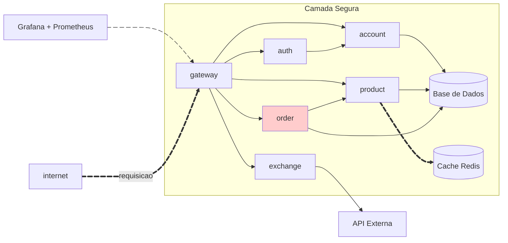

# Projeto API: Solução de Comércio Eletrônico

> Ferramentas de Monitoramento:
> - Grafana
> - Prometheus
> - Redis

## Introdução

Este documento apresenta um sistema inovador para e-commerce, implementado como uma API RESTful com Spring Boot. A aplicação é dividida em microserviços responsáveis por gerenciamento de contas, autenticação, produtos, pedidos e integração com um serviço de câmbio. O design enfatiza escalabilidade e modularidade, utilizando Docker e Kubernetes para gerenciamento de contêineres.

## Cronograma das Entregas

As seguintes etapas foram definidas para a conclusão:
- Exchange API – Finalização prevista: 02/06/2025
- Product API – Finalização prevista: 02/06/2025
- Order API – Finalização prevista: 02/06/2025

## Arquitetura do Sistema

A seguir, um diagrama ilustrativo do fluxo e integração dos serviços:



## Organização do Projeto

A estrutura de diretórios foi pensada para facilitar o desenvolvimento e a manutenção:

=== "Visão Geral dos Diretórios"

    ``` { .yaml .copy .select linenums='1' title="Estrutura de Pastas" }
    API/ (Apresentação interna para GitHub e testes locais)
    ├── exchange-service/ (Serviço independente)
    │   ├── app/
    │   │   ├── main.py
    │   │   └── routers.py
    │   ├── Dockerfile
    ├── gateway-service/ (Serviço independente)
    │   ├── src/
    │   │   └── main/
    │   │       ├── java/...
    │   │       └── resources/
    │   │           ├── application.yml
    │   │           └── arquivos adicionais
    ├── order/ (Dependência de serviço)
    │   ├── src/
    │   │   └── main/
    │   │       └── java/...
    │   └── pom.xml
    ├── order-service/ (Serviço independente)
    │   ├── src/
    │   │   └── main/
    │   │       ├── java/...
    │   │       └── resources/
    │   │           ├── application.yml
    │   │           └── arquivos adicionais
    ├── product/ (Dependência de serviço)
    │   ├── src/
    │   │   └── main/
    │   │       └── java/...
    │   └── pom.xml
    ├── product-service/ (Serviço independente)
    │   ├── src/
    │   │   └── main/
    │   │       ├── java/...
    │   │       └── resources/
    │   │           ├── application.yml
    │   │           └── arquivos adicionais
    │   └── pom.xml
    ├── account/ (Dependência de serviço)
    │   ├── src/
    │   │   └── main/
    │   │       └── java/...
    │   └── pom.xml
    ├── account-service/ (Serviço independente)
    │   ├── src/
    │   │   └── main/
    │   │       ├── java/...
    │   │       └── resources/
    │   │           ├── application.yml
    │   │           └── arquivos adicionais
    │   └── pom.xml
    ├── auth/ (Dependência de serviço)
    │   ├── src/
    │   │   └── main/
    │   │       └── java/...
    │   └── pom.xml
    ├── auth-service/ (Serviço independente)
    │   ├── src/
    │   │   └── main/
    │   │       ├── java/...
    │   │       └── resources/
    │   │           ├── application.yml
    │   │           └── arquivos adicionais
    │   └── pom.xml
    ```

=== "Configuração com Docker Compose"

    ``` { .yaml title="api/compose.yaml" }
    # compose.yaml
    services:
      db:
        image: postgres:latest
        hostname: db
        environment:
          POSTGRES_DB: ${POSTGRES_DB:-store}
          POSTGRES_USER: ${POSTGRES_USER:-store}
          POSTGRES_PASSWORD: ${POSTGRES_PASSWORD:-store}
        volumes:
          - postgres-data:/var/lib/postgresql/data
        networks:
          - store-project
    
      exchange:
        build:
          context: ./exchange-service
          dockerfile: Dockerfile
        networks:
          - store-project
    
      account:
        hostname: account
        build:
          context: ./account-service
          dockerfile: Dockerfile
        environment:
          DATABASE_HOST: db
          DATABASE_USER: ${POSTGRES_USER:-store}
          DATABASE_PASSWORD: ${POSTGRES_PASSWORD:-store}
        depends_on:
          - db
        networks:
          - store-project
    
      auth:
        hostname: auth
        build:
          context: ./auth-service
          dockerfile: Dockerfile
        environment:
          JWT_SECRET_KEY: ${JWT_SECRET_KEY:-yrBBgYlvJQeslzFlgX9MFZccToI2fjRFqualquercoisa}
        networks:
          - store-project
    
      gateway:
        hostname: gateway
        build:
          context: ./gateway-service
          dockerfile: Dockerfile
        environment:
          - LOGGING_LEVEL_STORE=${LOGGING_LEVEL_STORE:-debug}
        ports:
          - 8080:8080
        depends_on:
          - account
          - auth
          - product
          - order
          - exchange
        networks:
          - store-project
    
      product:
        hostname: product
        build:
          context: ./product-service
          dockerfile: Dockerfile
        environment:
          DATABASE_HOST: db
          DATABASE_USER: ${POSTGRES_USER:-store}
          DATABASE_PASSWORD: ${POSTGRES_PASSWORD:-store}
          REDIS_HOST: redis
        depends_on:
          - db
          - redis
        networks:
          - store-project
    
      order:
        hostname: order
        build:
          context: ./order-service
          dockerfile: Dockerfile
        environment:
          DATABASE_HOST: db
          DATABASE_USER: ${POSTGRES_USER:-store}
          DATABASE_PASSWORD: ${POSTGRES_PASSWORD:-store}
        depends_on:
          - db
        networks:
          - store-project
    
      prometheus:
        image: prom/prometheus:latest
        hostname: prometheus
        ports:
          - 9090:9090
        volumes:
          - prometheus-config:/etc/prometheus
        networks:
          - store-project
    
      grafana:
        image: grafana/grafana-enterprise
        hostname: grafana
        ports:
          - 3000:3000
        environment:
          - GF_SECURITY_ADMIN_PASSWORD=admin
        user: "472"
        volumes:
          - grafana-data:/var/lib/grafana
          - grafana-provisioning:/etc/grafana/provisioning/datasources
        depends_on:
          - prometheus
        networks:
          - store-project
    
      redis:
        image: redis:latest
        hostname: redis
        ports:
          - 6379:6379
        networks:
          - store-project
    
    volumes:
      postgres-data:
      prometheus-config:
      grafana-data:
      grafana-provisioning:
    
    networks:
      store-project:
        driver: bridge
    ```

## Demonstração

Assista a um vídeo que exemplifica a operação do sistema:

<div align="center">
    <iframe width="560" height="315" src="https://www.youtube.com/embed/4KQD3JL6HKk" frameborder="0" allowfullscreen></iframe>
</div>

## Recursos Adicionais

Para personalizar e explorar mais funcionalidades, consulte a documentação oficial do MkDocs Material:
[Documentação MkDocs Material](https://squidfunk.github.io/mkdocs-material/reference/){:target='_blank'}

